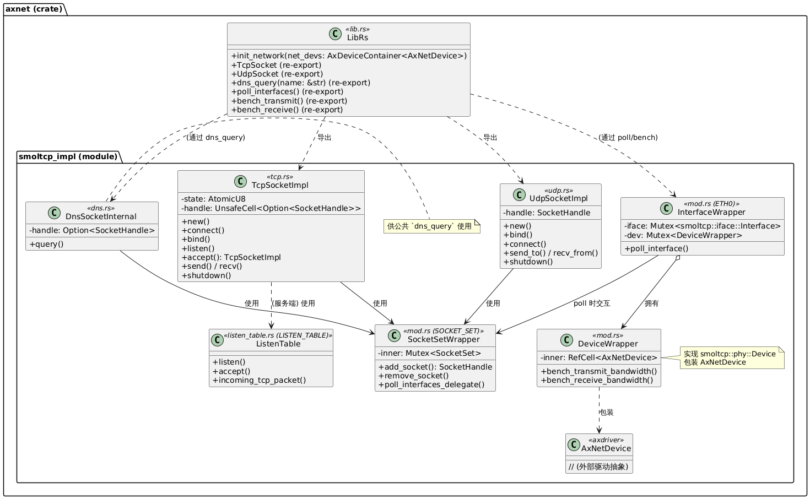

# axnet 模块概述
**注意：target里面有doc文件夹，那里面是使用cargo doc生成的文件夹，是可以交互的html文件，可以一起阅读增进理解**

axnet 是 ArceOS 的网络模块。它为 TCP/UDP 通信提供了统一的网络原语，支持多种底层网络栈。当前，主要支持并默认使用 smoltcp 作为底层网络栈。

## 主要功能
该模块的核心功能包括：

TcpSocket: 提供类 POSIX API 的 TCP 套接字。

UdpSocket: 提供类 POSIX API 的 UDP 套接字。

dns_query: 用于执行 DNS 查询的功能。

网络接口初始化和轮询。

网络吞吐量基准测试。


## Cargo 特性
smoltcp: 使用 smoltcp 作为底层网络栈。此特性默认启用。

# 模块组织
axnet 模块的源代码结构如下：

lib.rs: 位于模块的顶层 (例如 axnet/src/lib.rs)，是整个模块的入口，定义了公共 API 并组织了内部实现模块。

smoltcp_impl/: 这是一个子目录 (例如 axnet/src/smoltcp_impl/)，包含了基于 smoltcp 的具体网络协议实现。

mod.rs: smoltcp_impl 模块的核心，负责初始化网络接口、管理套接字集合，并定义了与底层硬件设备交互的包装器。

tcp.rs: TcpSocket 的具体实现。

udp.rs: UdpSocket 的具体实现。

dns.rs: DNS 查询逻辑的实现，包括 DnsSocket 结构体。（注：这些查询与链接都是直接创建完整结构体十分直观的实现）

addr.rs: 提供 std::net 和 smoltcp 地址类型之间的转换工具函数。(注：目前没有IPV6的地址)

listen_table.rs: TCP 服务器监听队列 ListenTable 的实现，用于管理进入的连接请求。

bench.rs: 实现了网络传输和接收带宽的基准测试功能。

lib.rs 通过 mod smoltcp_impl; use smoltcp_impl as net_impl; 来引用和使用 smoltcp_impl 模块中定义的具体实现。
# 在项目里的实现
**这里的功能在项目里实际上是通过宏定义将这些方法作为rustapi接口的实现**

整体而言，是一个axnet -> arceos_api//src/impl/net.rs -> 宏定义 -> ulib/axstd -> app

axruntime中最开始整个系统的初始化
```rust
//arceos\modules\axruntime\src\lib.rs
    #[cfg(any(feature = "fs", feature = "net", feature = "display"))]
    {
        #[allow(unused_variables)]
        let all_devices = axdriver::init_drivers();

        #[cfg(feature = "fs")]
        axfs::init_filesystems(all_devices.block);

        #[cfg(feature = "net")]
        axnet::init_network(all_devices.net);

        #[cfg(feature = "display")]
        axdisplay::init_display(all_devices.display);
    }
```

net.rs里面有一层一对一的映射，将底层投影到api，api又通过宏定义实现了ulib。这里在宏定义那里是解耦的，就是说如果宏定义为实现，
rust会生成空函数，如果调用了会报错。宏定义定义的会直接成为axstd的基础实现，axstd就直达应用层了
```rust
//net.rs部分

pub fn ax_tcp_socket() -> AxTcpSocketHandle {
    AxTcpSocketHandle(TcpSocket::new())
}

pub fn ax_tcp_socket_addr(socket: &AxTcpSocketHandle) -> AxResult<SocketAddr> {
    socket.0.local_addr()
}

pub fn ax_tcp_peer_addr(socket: &AxTcpSocketHandle) -> AxResult<SocketAddr> {
    socket.0.peer_addr()
}

pub fn ax_tcp_set_nonblocking(socket: &AxTcpSocketHandle, nonblocking: bool) -> AxResult {
    socket.0.set_nonblocking(nonblocking);
    Ok(())
}

pub fn ax_tcp_connect(socket: &AxTcpSocketHandle, addr: SocketAddr) -> AxResult {
    socket.0.connect(addr)
}

pub fn ax_tcp_bind(socket: &AxTcpSocketHandle, addr: SocketAddr) -> AxResult {
    socket.0.bind(addr)
}

pub fn ax_tcp_listen(socket: &AxTcpSocketHandle, _backlog: usize) -> AxResult {
    socket.0.listen()
}

pub fn ax_tcp_accept(socket: &AxTcpSocketHandle) -> AxResult<(AxTcpSocketHandle, SocketAddr)> {
    let new_sock = socket.0.accept()?;
    let addr = new_sock.peer_addr()?;
    Ok((AxTcpSocketHandle(new_sock), addr))
}

pub fn ax_tcp_send(socket: &AxTcpSocketHandle, buf: &[u8]) -> AxResult<usize> {
    socket.0.send(buf)
}

pub fn ax_tcp_recv(socket: &AxTcpSocketHandle, buf: &mut [u8]) -> AxResult<usize> {
    socket.0.recv(buf)
}

pub fn ax_tcp_poll(socket: &AxTcpSocketHandle) -> AxResult<AxPollState> {
    socket.0.poll()
}

pub fn ax_tcp_shutdown(socket: &AxTcpSocketHandle) -> AxResult {
    socket.0.shutdown()
}


```
```rust
//axstd对于tcp的实现注意api::的调用
impl TcpListener {
    /// Creates a new `TcpListener` which will be bound to the specified
    /// address.
    ///
    /// The returned listener is ready for accepting connections.
    ///
    /// Binding with a port number of 0 will request that the OS assigns a port
    /// to this listener. The port allocated can be queried via the
    /// [`TcpListener::local_addr`] method.
    ///
    /// The address type can be any implementor of [`ToSocketAddrs`] trait. See
    /// its documentation for concrete examples.
    ///
    /// If `addr` yields multiple addresses, `bind` will be attempted with
    /// each of the addresses until one succeeds and returns the listener. If
    /// none of the addresses succeed in creating a listener, the error returned
    /// from the last attempt (the last address) is returned.
    pub fn bind<A: ToSocketAddrs>(addr: A) -> io::Result<TcpListener> {
        super::each_addr(addr, |addr: io::Result<&SocketAddr>| {
            let addr = addr?;
            let backlog = 128;
            let socket = api::ax_tcp_socket();//注意这里直接调用的api crate的实现
            api::ax_tcp_bind(&socket, *addr)?;
            api::ax_tcp_listen(&socket, backlog)?;
            Ok(TcpListener(socket))
        })
    }

    /// Returns the local socket address of this listener.
    pub fn local_addr(&self) -> io::Result<SocketAddr> {
        api::ax_tcp_socket_addr(&self.0)
    }

    /// Accept a new incoming connection from this listener.
    ///
    /// This function will block the calling thread until a new TCP connection
    /// is established. When established, the corresponding [`TcpStream`] and the
    /// remote peer's address will be returned.
    pub fn accept(&self) -> io::Result<(TcpStream, SocketAddr)> {
        api::ax_tcp_accept(&self.0).map(|(a, b)| (TcpStream(a), b))
    }
}


```


# 初始化与配置
## 网络初始化
通过调用 axnet::init_network(net_devs: AxDeviceContainer<AxNetDevice>) 函数来初始化网络子系统。此函数会获取一个可用的网络接口控制器 (NIC) 设备，并用它来初始化 smoltcp_impl 后端。
```rust
// In lib.rs
use axdriver::{AxDeviceContainer, prelude::*};

/// Initializes the network subsystem by NIC devices.
pub fn init_network(mut net_devs: AxDeviceContainer<AxNetDevice>) {
    info!("Initialize network subsystem...");

    // Takes the first available NIC device.
    // Consider allowing selection or multiple NICs in the future.
    let dev = net_devs.take_one().expect("No NIC device found!");
    info!("  use NIC 0: {:?}", dev.device_name());
    net_impl::init(dev); // Calls smoltcp_impl::init
}
```
在 smoltcp_impl::init() 内部：
```rust
// In smoltcp_impl/mod.rs
pub(crate) fn init(net_dev: AxNetDevice) {
    let ether_addr = EthernetAddress(net_dev.mac_address().0); // Get MAC address from the device
    let eth0 = InterfaceWrapper::new("eth0", net_dev, ether_addr);

    // Parse IP and Gateway from environment variables or use defaults.
    // AX_IP, AX_GW, IP_PREFIX need to be set or have sensible defaults.
    let ip_str = IP; // From `env_or_default!("AX_IP")`
    let gateway_str = GATEWAY; // From `env_or_default!("AX_GW")`

    let ip = ip_str.parse().expect("invalid IP address");
    let gateway = gateway_str.parse().expect("invalid gateway IP address");
    // IP_PREFIX is likely a u8, e.g., 24 for /24 subnet.

    eth0.setup_ip_addr(ip, IP_PREFIX);
    eth0.setup_gateway(gateway);

    // Initialize global static variables.
    // ETH0, SOCKET_SET, LISTEN_TABLE are LazyInit.
    ETH0.init_once(|| eth0); // Initialize ETH0 with the configured InterfaceWrapper
    SOCKET_SET.init_once(SocketSetWrapper::new); // Initialize the global socket set
    LISTEN_TABLE.init_once(ListenTable::new); // Initialize the TCP listen table

    // Log network configuration
    info!("created net interface {:?}:", ETH0.name());
    info!("  ether:    {}", ETH0.ethernet_address());
    info!("  ip:       {}/{}", ip, IP_PREFIX);
    info!("  gateway:  {}", gateway);

    // Potentially configure DNS servers for DnsSocket if not hardcoded in new_dns_socket
    // For example, by calling a method on DnsSocket if it exists,
    // or by initializing new_dns_socket with servers from config.
    // The current DnsSocket::new uses a hardcoded DNS_SEVER.
}
```
1. 会为选定的网络设备创建一个 InterfaceWrapper (名为 ETH0)。
2. 配置 MAC 地址。
3. 从环境变量 AX_IP (IP 地址) 和 AX_GW (网关地址) 中读取网络配置，或使用代码中定义的默认值。默认的 DNS 服务器地址为 "8.8.8.8"。IP 地址前缀长度默认为 24。
4. 初始化全局的套接字集合 SOCKET_SET (类型为 SocketSetWrapper) 和 TCP 监听表 LISTEN_TABLE。

## 常量和配置
模块定义了一些重要的常量：

STANDARD_MTU: 1500 字节。

TCP/UDP 接收/发送缓冲区大小: 均为 64KB。

TCP 监听队列大小 (LISTEN_QUEUE_SIZE): 512。

# 核心组件与 API

## TcpSocket (TCP 套接字)
TcpSocket 提供了面向连接的可靠数据传输服务。

### 创建: 
TcpSocket::new()
```rust
/// Creates a new TCP socket.
    pub const fn new() -> Self {
        Self {
            state: AtomicU8::new(STATE_CLOSED),
            handle: UnsafeCell::new(None),
            local_addr: UnsafeCell::new(UNSPECIFIED_ENDPOINT),
            peer_addr: UnsafeCell::new(UNSPECIFIED_ENDPOINT),
            nonblock: AtomicBool::new(false),
        }
    }
```
创建一个新的 TCP 套接字，初始状态为 CLOSED。

### 客户端操作:
connect(remote_addr: SocketAddr) -> AxResult: 连接到指定的远程地址和端口。
```rust
/// Connects to the given address and port.
    ///
    /// The local port is generated automatically.
    pub fn connect(&self, remote_addr: SocketAddr) -> AxResult {
        self.update_state(STATE_CLOSED, STATE_CONNECTING, || {
            // SAFETY: no other threads can read or write these fields.
            let handle = unsafe { self.handle.get().read() }
                .unwrap_or_else(|| SOCKET_SET.add(SocketSetWrapper::new_tcp_socket()));

            // TODO: check remote addr unreachable
            let remote_endpoint = from_core_sockaddr(remote_addr);
            let bound_endpoint = self.bound_endpoint()?;
            let iface = &ETH0.iface;
            let (local_endpoint, remote_endpoint) = SOCKET_SET
                .with_socket_mut::<tcp::Socket, _, _>(handle, |socket| {
                    socket
                        .connect(iface.lock().context(), remote_endpoint, bound_endpoint)
                        .or_else(|e| match e {
                            ConnectError::InvalidState => {
                                ax_err!(BadState, "socket connect() failed")
                            }
                            ConnectError::Unaddressable => {
                                ax_err!(ConnectionRefused, "socket connect() failed")
                            }
                        })?;
                    Ok((
                        socket.local_endpoint().unwrap(),
                        socket.remote_endpoint().unwrap(),
                    ))
                })?;
            unsafe {
                // SAFETY: no other threads can read or write these fields as we
                // have changed the state to `BUSY`.
                self.local_addr.get().write(local_endpoint);
                self.peer_addr.get().write(remote_endpoint);
                self.handle.get().write(Some(handle));
            }
            Ok(())
        })
        .unwrap_or_else(|_| ax_err!(AlreadyExists, "socket connect() failed: already connected"))?; // EISCONN

        // Here our state must be `CONNECTING`, and only one thread can run here.
        if self.is_nonblocking() {
            Err(AxError::WouldBlock)
        } else {
            self.block_on(|| {
                let PollState { writable, .. } = self.poll_connect()?;
                if !writable {
                    Err(AxError::WouldBlock)
                } else if self.get_state() == STATE_CONNECTED {
                    Ok(())
                } else {
                    ax_err!(ConnectionRefused, "socket connect() failed")
                }
            })
        }
    }
```
如果套接字是非阻塞的，此方法可能会立即返回 Err(AxError::WouldBlock)。
### 服务端操作:
bind(local_addr: SocketAddr) -> AxResult: 将套接字绑定到本地 IP 地址和端口。如果端口为 0，则会自动分配一个临时端口。
```rust
/// Binds an unbound socket to the given address and port.
    ///
    /// If the given port is 0, it generates one automatically.
    ///
    /// It's must be called before [`listen`](Self::listen) and
    /// [`accept`](Self::accept).
    pub fn bind(&self, mut local_addr: SocketAddr) -> AxResult {
        self.update_state(STATE_CLOSED, STATE_CLOSED, || {
            // TODO: check addr is available
            if local_addr.port() == 0 {
                local_addr.set_port(get_ephemeral_port()?);
            }
            // SAFETY: no other threads can read or write `self.local_addr` as we
            // have changed the state to `BUSY`.
            unsafe {
                let old = self.local_addr.get().read();
                if old != UNSPECIFIED_ENDPOINT {
                    return ax_err!(InvalidInput, "socket bind() failed: already bound");
                }
                self.local_addr.get().write(from_core_sockaddr(local_addr));
            }
            Ok(())
        })
        .unwrap_or_else(|_| ax_err!(InvalidInput, "socket bind() failed: already bound"))
    }

```

listen() -> AxResult: 开始监听绑定的地址和端口上的传入连接。内部使用 ListenTable。
```rust
/// Starts listening on the bound address and port.
    ///
    /// It's must be called after [`bind`](Self::bind) and before
    /// [`accept`](Self::accept).
    pub fn listen(&self) -> AxResult {
        self.update_state(STATE_CLOSED, STATE_LISTENING, || {
            let bound_endpoint = self.bound_endpoint()?;
            unsafe {
                (*self.local_addr.get()).port = bound_endpoint.port;
            }
            LISTEN_TABLE.listen(bound_endpoint)?;
            debug!("TCP socket listening on {}", bound_endpoint);
            Ok(())
        })
        .unwrap_or(Ok(())) // ignore simultaneous `listen`s.
    }
```
accept() -> AxResult<TcpSocket>: 接受一个新的连接。
```rust
/// Accepts a new connection.
    ///
    /// This function will block the calling thread until a new TCP connection
    /// is established. When established, a new [`TcpSocket`] is returned.
    ///
    /// It's must be called after [`bind`](Self::bind) and [`listen`](Self::listen).
    pub fn accept(&self) -> AxResult<TcpSocket> {
        if !self.is_listening() {
            return ax_err!(InvalidInput, "socket accept() failed: not listen");
        }

        // SAFETY: `self.local_addr` should be initialized after `bind()`.
        let local_port = unsafe { self.local_addr.get().read().port };
        self.block_on(|| {
            let (handle, (local_addr, peer_addr)) = LISTEN_TABLE.accept(local_port)?;
            debug!("TCP socket accepted a new connection {}", peer_addr);
            Ok(TcpSocket::new_connected(handle, local_addr, peer_addr))
        })
    }
```
如果套接字是非阻塞的且没有挂起的连接，则返回 Err(AxError::WouldBlock)。

成功时返回一个新的 TcpSocket 实例，代表与客户端建立的连接。

### 数据收发:
send(buf: &[u8]) -> AxResult<usize>: 发送数据。
```rust
/// Transmits data in the given buffer.
    pub fn send(&self, buf: &[u8]) -> AxResult<usize> {
        if self.is_connecting() {
            return Err(AxError::WouldBlock);
        } else if !self.is_connected() {
            return ax_err!(NotConnected, "socket send() failed");
        }

        // SAFETY: `self.handle` should be initialized in a connected socket.
        let handle = unsafe { self.handle.get().read().unwrap() };
        self.block_on(|| {
            SOCKET_SET.with_socket_mut::<tcp::Socket, _, _>(handle, |socket| {
                if !socket.is_active() || !socket.may_send() {
                    // closed by remote
                    ax_err!(ConnectionReset, "socket send() failed")
                } else if socket.can_send() {
                    // connected, and the tx buffer is not full
                    // TODO: use socket.send(|buf| {...})
                    let len = socket
                        .send_slice(buf)
                        .map_err(|_| ax_err_type!(BadState, "socket send() failed"))?;
                    Ok(len)
                } else {
                    // tx buffer is full
                    Err(AxError::WouldBlock)
                }
            })
        })
    }
```
recv(buf: &mut [u8]) -> AxResult<usize>: 接收数据。
````rust
/// Receives data from the socket, stores it in the given buffer.
    pub fn recv(&self, buf: &mut [u8]) -> AxResult<usize> {
        if self.is_connecting() {
            return Err(AxError::WouldBlock);
        } else if !self.is_connected() {
            return ax_err!(NotConnected, "socket recv() failed");
        }

        // SAFETY: `self.handle` should be initialized in a connected socket.
        let handle = unsafe { self.handle.get().read().unwrap() };
        self.block_on(|| {
            SOCKET_SET.with_socket_mut::<tcp::Socket, _, _>(handle, |socket| {
                if !socket.is_active() {
                    // not open
                    ax_err!(ConnectionRefused, "socket recv() failed")
                } else if !socket.may_recv() {
                    // connection closed
                    Ok(0)
                } else if socket.recv_queue() > 0 {
                    // data available
                    // TODO: use socket.recv(|buf| {...})
                    let len = socket
                        .recv_slice(buf)
                        .map_err(|_| ax_err_type!(BadState, "socket recv() failed"))?;
                    Ok(len)
                } else {
                    // no more data
                    Err(AxError::WouldBlock)
                }
            })
        })
    }
````
如果连接已关闭，返回 Ok(0)。

在非阻塞模式下，如果没有数据可读，返回 Err(AxError::WouldBlock)。

### 关闭:
shutdown() -> AxResult: 关闭连接的读取、写入或两者。这会改变套接字状态并可能释放相关资源。
```rust
/// Close the connection.
    pub fn shutdown(&self) -> AxResult {
        // stream
        self.update_state(STATE_CONNECTED, STATE_CLOSED, || {
            // SAFETY: `self.handle` should be initialized in a connected socket, and
            // no other threads can read or write it.
            let handle = unsafe { self.handle.get().read().unwrap() };
            SOCKET_SET.with_socket_mut::<tcp::Socket, _, _>(handle, |socket| {
                debug!("TCP socket {}: shutting down", handle);
                socket.close();
            });
            unsafe { self.local_addr.get().write(UNSPECIFIED_ENDPOINT) }; // clear bound address
            SOCKET_SET.poll_interfaces();
            Ok(())
        })
        .unwrap_or(Ok(()))?;

        // listener
        self.update_state(STATE_LISTENING, STATE_CLOSED, || {
            // SAFETY: `self.local_addr` should be initialized in a listening socket,
            // and no other threads can read or write it.
            let local_port = unsafe { self.local_addr.get().read().port };
            unsafe { self.local_addr.get().write(UNSPECIFIED_ENDPOINT) }; // clear bound address
            LISTEN_TABLE.unlisten(local_port);
            SOCKET_SET.poll_interfaces();
            Ok(())
        })
        .unwrap_or(Ok(()))?;

        // ignore for other states
        Ok(())
    }
```
### 非阻塞模式:
is_nonblocking() -> bool: 检查套接字是否处于非阻塞模式。
```rust
/// Returns whether this socket is in nonblocking mode.
    #[inline]
    pub fn is_nonblocking(&self) -> bool {
        self.nonblock.load(Ordering::Acquire)
    }
```
set_nonblocking(nonblocking: bool): 设置套接字的非阻塞模式。
```rust
/// Moves this TCP stream into or out of nonblocking mode.
    ///
    /// This will result in `read`, `write`, `recv` and `send` operations
    /// becoming nonblocking, i.e., immediately returning from their calls.
    /// If the IO operation is successful, `Ok` is returned and no further
    /// action is required. If the IO operation could not be completed and needs
    /// to be retried, an error with kind  [`Err(WouldBlock)`](AxError::WouldBlock) is
    /// returned.
    #[inline]
    pub fn set_nonblocking(&self, nonblocking: bool) {
        self.nonblock.store(nonblocking, Ordering::Release);
    }
```
### 状态查询:
local_addr() -> AxResult<SocketAddr>: 获取本地套接字地址。
```rust
/// Returns the local address and port, or
    /// [`Err(NotConnected)`](AxError::NotConnected) if not connected.
    #[inline]
    pub fn local_addr(&self) -> AxResult<SocketAddr> {
        match self.get_state() {
            STATE_CONNECTED | STATE_LISTENING => {
                Ok(into_core_sockaddr(unsafe { self.local_addr.get().read() }))
            }
            _ => Err(AxError::NotConnected),
        }
    }
```
peer_addr() -> AxResult<SocketAddr>: 获取对端套接字地址。
```rust
/// Returns the remote address and port, or
    /// [`Err(NotConnected)`](AxError::NotConnected) if not connected.
    #[inline]
    pub fn peer_addr(&self) -> AxResult<SocketAddr> {
        match self.get_state() {
            STATE_CONNECTED | STATE_LISTENING => {
                Ok(into_core_sockaddr(unsafe { self.peer_addr.get().read() }))
            }
            _ => Err(AxError::NotConnected),
        }
    }
```
poll() -> AxResult<PollState>: 查询套接字的可读/可写状态。
```rust
/// Whether the socket is readable or writable.
    pub fn poll(&self) -> AxResult<PollState> {
        match self.get_state() {
            STATE_CONNECTING => self.poll_connect(),
            STATE_CONNECTED => self.poll_stream(),
            STATE_LISTENING => self.poll_listener(),
            _ => Ok(PollState {
                readable: false,
                writable: false,
            }),
        }
    }
```
## UdpSocket (UDP 套接字)
UdpSocket 提供了无连接的数据报服务。

### 创建: 
UdpSocket::new()
```rust
/// Creates a new UDP socket.
    #[allow(clippy::new_without_default)]
    pub fn new() -> Self {
        let socket = SocketSetWrapper::new_udp_socket();
        let handle = SOCKET_SET.add(socket);
        Self {
            handle,
            local_addr: RwLock::new(None),
            peer_addr: RwLock::new(None),
            nonblock: AtomicBool::new(false),
        }
    }
```
创建一个新的 UDP 套接字，并将其添加到全局的 SOCKET_SET 中。
### 操作:
bind(local_addr: SocketAddr) -> AxResult: 将套接字绑定到本地 IP 地址和端口。如果端口为 0，则会自动分配一个临时端口。必须在 send_to 或 recv_from 之前调用。
```rust
/// Binds an unbound socket to the given address and port.
    ///
    /// It's must be called before [`send_to`](Self::send_to) and
    /// [`recv_from`](Self::recv_from).
    pub fn bind(&self, mut local_addr: SocketAddr) -> AxResult {
        let mut self_local_addr = self.local_addr.write();

        if local_addr.port() == 0 {
            local_addr.set_port(get_ephemeral_port()?);
        }
        if self_local_addr.is_some() {
            return ax_err!(InvalidInput, "socket bind() failed: already bound");
        }

        let local_endpoint = from_core_sockaddr(local_addr);
        let endpoint = IpListenEndpoint {
            addr: (!is_unspecified(local_endpoint.addr)).then_some(local_endpoint.addr),
            port: local_endpoint.port,
        };
        SOCKET_SET.with_socket_mut::<udp::Socket, _, _>(self.handle, |socket| {
            socket.bind(endpoint).or_else(|e| match e {
                BindError::InvalidState => ax_err!(AlreadyExists, "socket bind() failed"),
                BindError::Unaddressable => ax_err!(InvalidInput, "socket bind() failed"),
            })
        })?;

        *self_local_addr = Some(local_endpoint);
        debug!("UDP socket {}: bound on {}", self.handle, endpoint);
        Ok(())
    }
```
connect(addr: SocketAddr) -> AxResult: 将套接字“连接”到指定的远程地址。这允许之后使用 send 和 recv，并过滤只接收来自该远程地址的数据。如果未绑定，则会自动绑定到一个临时端口。
```rust
/// Connects this UDP socket to a remote address, allowing the `send` and
    /// `recv` to be used to send data and also applies filters to only receive
    /// data from the specified address.
    ///
    /// The local port will be generated automatically if the socket is not bound.
    /// It's must be called before [`send`](Self::send) and
    /// [`recv`](Self::recv).
    pub fn connect(&self, addr: SocketAddr) -> AxResult {
        let mut self_peer_addr = self.peer_addr.write();

        if self.local_addr.read().is_none() {
            self.bind(into_core_sockaddr(UNSPECIFIED_ENDPOINT))?;
        }

        *self_peer_addr = Some(from_core_sockaddr(addr));
        debug!("UDP socket {}: connected to {}", self.handle, addr);
        Ok(())
    }
```
### 数据收发:
send_to(buf: &[u8], remote_addr: SocketAddr) -> AxResult<usize>: 将数据发送到指定的远程地址。
```rust
/// Sends data on the socket to the given address. On success, returns the
    /// number of bytes written.
    pub fn send_to(&self, buf: &[u8], remote_addr: SocketAddr) -> AxResult<usize> {
        if remote_addr.port() == 0 || remote_addr.ip().is_unspecified() {
            return ax_err!(InvalidInput, "socket send_to() failed: invalid address");
        }
        self.send_impl(buf, from_core_sockaddr(remote_addr))
    }
```
recv_from(buf: &mut [u8]) -> AxResult<(usize, SocketAddr)>: 从套接字接收数据，并返回读取的字节数以及数据的源地址。
```rust
/// Receives a single datagram message on the socket. On success, returns
    /// the number of bytes read and the origin.
    pub fn recv_from(&self, buf: &mut [u8]) -> AxResult<(usize, SocketAddr)> {
        self.recv_impl(|socket| match socket.recv_slice(buf) {
            Ok((len, meta)) => Ok((len, into_core_sockaddr(meta.endpoint))),
            Err(_) => ax_err!(BadState, "socket recv_from() failed"),
        })
    }
```
peek_from(buf: &mut [u8]) -> AxResult<(usize, SocketAddr)>: 类似 recv_from，但数据不会从接收队列中移除。
```rust
/// Receives a single datagram message on the socket, without removing it from
    /// the queue. On success, returns the number of bytes read and the origin.
    pub fn peek_from(&self, buf: &mut [u8]) -> AxResult<(usize, SocketAddr)> {
        self.recv_impl(|socket| match socket.peek_slice(buf) {
            Ok((len, meta)) => Ok((len, into_core_sockaddr(meta.endpoint))),
            Err(_) => ax_err!(BadState, "socket recv_from() failed"),
        })
    }
```
send(buf: &[u8]) -> AxResult<usize>: 将数据发送到先前 connect 指定的远程地址。
```rust
/// Sends data on the socket to the remote address to which it is connected.
    pub fn send(&self, buf: &[u8]) -> AxResult<usize> {
        let remote_endpoint = self.remote_endpoint()?;
        self.send_impl(buf, remote_endpoint)
    }
```
recv(buf: &mut [u8]) -> AxResult<usize>: 从先前 connect 指定的远程地址接收数据。
```rust
/// Receives a single datagram message on the socket from the remote address
    /// to which it is connected. On success, returns the number of bytes read.
    pub fn recv(&self, buf: &mut [u8]) -> AxResult<usize> {
        let remote_endpoint = self.remote_endpoint()?;
        self.recv_impl(|socket| {
            let (len, meta) = socket
                .recv_slice(buf)
                .map_err(|_| ax_err_type!(BadState, "socket recv() failed"))?;
            if !is_unspecified(remote_endpoint.addr) && remote_endpoint.addr != meta.endpoint.addr {
                return Err(AxError::WouldBlock);
            }
            if remote_endpoint.port != 0 && remote_endpoint.port != meta.endpoint.port {
                return Err(AxError::WouldBlock);
            }
            Ok(len)
        })
    }
```
### 关闭:
shutdown() -> AxResult: 关闭 UDP 套接字。
```rust
/// Close the socket.
    pub fn shutdown(&self) -> AxResult {
        SOCKET_SET.with_socket_mut::<udp::Socket, _, _>(self.handle, |socket| {
            debug!("UDP socket {}: shutting down", self.handle);
            socket.close();
        });
        SOCKET_SET.poll_interfaces();
        Ok(())
    }
```
### 非阻塞模式:
is_nonblocking() -> bool: 检查套接字是否处于非阻塞模式。
```rust
/// Returns whether this socket is in nonblocking mode.
    #[inline]
    pub fn is_nonblocking(&self) -> bool {
        self.nonblock.load(Ordering::Acquire)
    }
```
set_nonblocking(nonblocking: bool): 设置套接字的非阻塞模式。
```rust
/// Moves this UDP socket into or out of nonblocking mode.
    ///
    /// This will result in `recv`, `recv_from`, `send`, and `send_to`
    /// operations becoming nonblocking, i.e., immediately returning from their
    /// calls. If the IO operation is successful, `Ok` is returned and no
    /// further action is required. If the IO operation could not be completed
    /// and needs to be retried, an error with kind
    /// [`Err(WouldBlock)`](AxError::WouldBlock) is returned.
    #[inline]
    pub fn set_nonblocking(&self, nonblocking: bool) {
        self.nonblock.store(nonblocking, Ordering::Release);
    }
```
### 状态查询:
local_addr() -> AxResult<SocketAddr>: 获取本地套接字地址。
```rust
/// Returns the local address and port, or
    /// [`Err(NotConnected)`](AxError::NotConnected) if not connected.
    pub fn local_addr(&self) -> AxResult<SocketAddr> {
        match self.local_addr.try_read() {
            Some(addr) => addr.map(into_core_sockaddr).ok_or(AxError::NotConnected),
            None => Err(AxError::NotConnected),
        }
    }
```
peer_addr() -> AxResult<SocketAddr>: 获取（通过 connect 设置的）对端套接字地址。
```rust
/// Returns the remote address and port, or
    /// [`Err(NotConnected)`](AxError::NotConnected) if not connected.
    pub fn peer_addr(&self) -> AxResult<SocketAddr> {
        self.remote_endpoint().map(into_core_sockaddr)
    }
```
poll() -> AxResult<PollState>: 查询套接字的可读/可写状态。
```rust
/// Whether the socket is readable or writable.
    pub fn poll(&self) -> AxResult<PollState> {
        if self.local_addr.read().is_none() {
            return Ok(PollState {
                readable: false,
                writable: false,
            });
        }
        SOCKET_SET.with_socket_mut::<udp::Socket, _, _>(self.handle, |socket| {
            Ok(PollState {
                readable: socket.can_recv(),
                writable: socket.can_send(),
            })
        })
    }
```
## DNS 解析
dns_query(name: &str) -> AxResult<alloc::vec::Vec<IpAddr>>: 
执行 DNS A 记录查询，将域名解析为一个或多个 IP 地址。并且内部创建一个临时的 DnsSocket，使用配置的 DNS 服务器 (默认为 "8.8.8.8") 进行查询。
```rust
// In dns.rs
/// Public function for DNS query.
pub fn dns_query(name: &str) -> AxResult<alloc::vec::Vec<IpAddr>> {
    let socket = DnsSocket::new();
    socket.query(name, DnsQueryType::A)
}

// DnsSocket::query is called internally by dns_query.
// The DnsSocket struct and its methods:
/*
struct DnsSocket {
    handle: Option<SocketHandle>,
}

impl DnsSocket {
    #[allow(clippy::new_without_default)]
    /// Creates a new DNS socket.
    pub fn new() -> Self {
        let socket = SocketSetWrapper::new_dns_socket();
        let handle = Some(SOCKET_SET.add(socket));
        Self { handle }
    }

    /// Query a address with given DNS query type.
    pub fn query(&self, name: &str, query_type: DnsQueryType) -> AxResult<Vec<IpAddr>> {
        // let local_addr = self.local_addr.unwrap_or_else(f);
        let handle = self.handle.ok_or_else(|| ax_err_type!(InvalidInput))?;
        let iface = &ETH0.iface;
        let query_handle = SOCKET_SET
            .with_socket_mut::<dns::Socket, _, _>(handle, |socket| {
                socket.start_query(iface.lock().context(), name, query_type)
            })
            .map_err(|e| match e {
                StartQueryError::NoFreeSlot => {
                    ax_err_type!(ResourceBusy, "socket query() failed: no free slot")
                }
                StartQueryError::InvalidName => {
                    ax_err_type!(InvalidInput, "socket query() failed: invalid name")
                }
                StartQueryError::NameTooLong => {
                    ax_err_type!(InvalidInput, "socket query() failed: too long name")
                }
            })?;
        loop {
            SOCKET_SET.poll_interfaces();
            match SOCKET_SET.with_socket_mut::<dns::Socket, _, _>(handle, |socket| {
                socket.get_query_result(query_handle).map_err(|e| match e {
                    GetQueryResultError::Pending => AxError::WouldBlock,
                    GetQueryResultError::Failed => {
                        ax_err_type!(ConnectionRefused, "socket query() failed")
                    }
                })
            }) {
                Ok(n) => {
                    let mut res = Vec::with_capacity(n.capacity());
                    for ip in n {
                        res.push(into_core_ipaddr(ip))
                    }
                    return Ok(res);
                }
                Err(AxError::WouldBlock) => axtask::yield_now(),
                Err(e) => return Err(e),
            }
        }
    }
}
*/
```
## 网络栈轮询
poll_interfaces()
此函数应定期调用，以驱动网络栈处理。它会轮询网络接口，接收传入的数据包并将其分派给相应的套接字，同时发送套接字中排队等待传出的数据包。
对于非阻塞操作，此函数的及时调用至关重要。
```rust
// In smoltcp_impl/mod.rs
/// Poll the network stack.
///
/// It may receive packets from the NIC and process them, and transmit queued
/// packets to the NIC.
pub fn poll_interfaces() {
    SOCKET_SET.poll_interfaces();
}

// SocketSetWrapper::poll_interfaces method:
// impl<'a> SocketSetWrapper<'a> {
// ...
//     pub fn poll_interfaces(&self) {
//         ETH0.poll(&self.0);
//     }
// ...
// }

// InterfaceWrapper::poll method:
// impl InterfaceWrapper {
// ...
//     pub fn poll(&self, sockets: &Mutex<SocketSet>) {
//         let mut dev = self.dev.lock();
//         let mut iface = self.iface.lock();
//         let mut sockets = sockets.lock();
//         let timestamp = Self::current_time();
//         iface.poll(timestamp, dev.deref_mut(), &mut sockets);
//     }
// ...
// }
```
## 测试部分
bench_transmit(): 测试底层网络设备的最大传输带宽。它会尽可能快地发送大量数据包。
```rust
// In smoltcp_impl/mod.rs
/// Benchmark raw socket transmit bandwidth.
pub fn bench_transmit() {
    ETH0.dev.lock().bench_transmit_bandwidth();
}

// The actual implementation is in bench.rs:
// impl DeviceWrapper {
//     pub fn bench_transmit_bandwidth(&mut self) {
//         // 10 Gb
//         const MAX_SEND_BYTES: usize = 10 * GB;
//         let mut send_bytes: usize = 0;
//         let mut past_send_bytes: usize = 0;
//         let mut past_time = InterfaceWrapper::current_time();

//         // Send bytes
//         while send_bytes < MAX_SEND_BYTES {
//             if let Some(tx_token) = self.transmit(InterfaceWrapper::current_time()) {
//                 AxNetTxToken::consume(tx_token, STANDARD_MTU, |tx_buf| {
//                     tx_buf[0..12].fill(1);
//                     // ether type: IPv4
//                     tx_buf[12..14].copy_from_slice(&[0x08, 0x00]);
//                     tx_buf[14..STANDARD_MTU].fill(1);
//                 });
//                 send_bytes += STANDARD_MTU;
//             }

//             let current_time = InterfaceWrapper::current_time();
//             if (current_time - past_time).secs() == 1 {
//                 let gb = ((send_bytes - past_send_bytes) * 8) / GB;
//                 let mb = (((send_bytes - past_send_bytes) * 8) % GB) / MB;
//                 let gib = (send_bytes - past_send_bytes) / GB;
//                 let mib = ((send_bytes - past_send_bytes) % GB) / MB;
//                 info!(
//                     "Transmit: {}.{:03}GBytes, Bandwidth: {}.{:03}Gbits/sec.",
//                     gib, mib, gb, mb
//                 );
//                 past_time = current_time;
//                 past_send_bytes = send_bytes;
//             }
//         }
//     }
// }
```
bench_receive(): 测试底层网络设备的最大接收带宽。它会持续接收数据包并统计速率。
```rust
// In smoltcp_impl/mod.rs
/// Benchmark raw socket receive bandwidth.
pub fn bench_receive() {
    ETH0.dev.lock().bench_receive_bandwidth();
}

// The actual implementation is in bench.rs:
// impl DeviceWrapper {
//     pub fn bench_receive_bandwidth(&mut self) {
//         // 10 Gb
//         const MAX_RECEIVE_BYTES: usize = 10 * GB;
//         let mut receive_bytes: usize = 0;
//         let mut past_receive_bytes: usize = 0;
//         let mut past_time = InterfaceWrapper::current_time();
//         // Receive bytes
//         while receive_bytes < MAX_RECEIVE_BYTES {
//             if let Some(rx_token) = self.receive(InterfaceWrapper::current_time()) {
//                 AxNetRxToken::consume(rx_token.0, |rx_buf| {
//                     receive_bytes += rx_buf.len();
//                 });
//             }

//             let current_time = InterfaceWrapper::current_time();
//             if (current_time - past_time).secs() == 1 {
//                 let gb = ((receive_bytes - past_receive_bytes) * 8) / GB;
//                 let mb = (((receive_bytes - past_receive_bytes) * 8) % GB) / MB;
//                 let gib = (receive_bytes - past_receive_bytes) / GB;
//                 let mib = ((receive_bytes - past_receive_bytes) % GB) / MB;
//                 info!(
//                     "Receive: {}.{:03}GBytes, Bandwidth: {}.{:03}Gbits/sec.",
//                     gib, mib, gb, mb
//                 );
//                 past_time = current_time;
//                 past_receive_bytes = receive_bytes;
//             }
//         }
//     }
// }
```
这两个函数通常用于性能评估和调试。

# 内部机制简介
InterfaceWrapper (ETH0): 代表一个网络接口 (如 eth0)。它包装了 smoltcp::iface::Interface 和一个 DeviceWrapper。InterfaceWrapper 负责管理接口的 IP 配置、路由，并通过其 poll 方法驱动 smoltcp 的核心处理逻辑。
```rust
// In smoltcp_impl/mod.rs
struct InterfaceWrapper {
    name: &'static str,
    ether_addr: EthernetAddress,
    dev: Mutex<DeviceWrapper>,
    iface: Mutex<Interface>,
}

// InterfaceWrapper::poll method:
impl InterfaceWrapper {
// ...
    fn current_time() -> Instant {
        Instant::from_micros_const((wall_time_nanos() / NANOS_PER_MICROS) as i64)
    }

    pub fn name(&self) -> &str {
        self.name
    }

    pub fn ethernet_address(&self) -> EthernetAddress {
        self.ether_addr
    }

    pub fn setup_ip_addr(&self, ip: IpAddress, prefix_len: u8) {
        let mut iface = self.iface.lock();
        iface.update_ip_addrs(|ip_addrs| {
            ip_addrs.push(IpCidr::new(ip, prefix_len)).unwrap();
        });
    }

    pub fn setup_gateway(&self, gateway: IpAddress) {
        let mut iface = self.iface.lock();
        match gateway {
            IpAddress::Ipv4(v4) => iface.routes_mut().add_default_ipv4_route(v4).unwrap(),
            _ => {None} // Or handle IPv6 if supported in future
        };
    }

    pub fn poll(&self, sockets: &Mutex<SocketSet>) {
        let mut dev = self.dev.lock();
        let mut iface = self.iface.lock();
        let mut sockets = sockets.lock();
        let timestamp = Self::current_time();
        iface.poll(timestamp, dev.deref_mut(), &mut sockets);
    }
// ...
}
```
DeviceWrapper: 对 axdriver::AxNetDevice（一个网络硬件驱动的抽象）的包装，实现了 smoltcp::phy::Device trait。它使得 smoltcp 可以通过标准接口与具体的网络硬件交互，进行数据包的收发。
```rust
// In smoltcp_impl/mod.rs
struct DeviceWrapper {
    inner: RefCell<AxNetDevice>, // use `RefCell` is enough since it's wrapped in `Mutex` in `InterfaceWrapper`.
}

impl DeviceWrapper {
    fn new(inner: AxNetDevice) -> Self {
        Self {
            inner: RefCell::new(inner),
        }
    }
}

// impl smoltcp::phy::Device for DeviceWrapper
impl Device for DeviceWrapper {
    type RxToken<'a>
        = AxNetRxToken<'a>
    where
        Self: 'a;
    type TxToken<'a>
        = AxNetTxToken<'a>
    where
        Self: 'a;

    fn receive(&mut self, _timestamp: Instant) -> Option<(Self::RxToken<'_>, Self::TxToken<'_>)> {
        let mut dev = self.inner.borrow_mut();
        if let Err(e) = dev.recycle_tx_buffers() {
            warn!("recycle_tx_buffers failed: {:?}", e);
            return None;
        }

        if !dev.can_transmit() {
            // If we can't transmit, smoltcp expects to still be able to receive.
            // However, our AxNetDevice model might imply that if tx is blocked,
            // rx might also be affected or that we need a tx token to unlock hw.
            // For now, we proceed to try receiving.
            // This behavior might need adjustment based on specific driver semantics.
        }
        let rx_buf = match dev.receive() {
            Ok(buf) => buf,
            Err(err) => {
                if !matches!(err, DevError::Again) {
                    warn!("receive failed: {:?}", err);
                }
                return None;
            }
        };
        // Ensure we can provide a TxToken. If not, we can't accept the RxToken.
        if !dev.can_transmit() {
             // This case needs careful handling. Smoltcp expects both if Rx is returned.
             // If we cannot guarantee a TxToken, we should not return an RxToken.
             // For now, assuming `can_transmit` check at start is enough or TxToken can always be created.
             // A more robust way might be to try to get a TxToken first.
            warn!("Cannot provide TxToken after receiving, may lead to issues.");
            // Depending on strictness, one might drop rx_buf and return None.
            // self.inner.borrow_mut().recycle_rx_buffer(rx_buf).ok(); // example of dropping
            // return None;
        }
        Some((AxNetRxToken(&self.inner, rx_buf), AxNetTxToken(&self.inner)))
    }

    fn transmit(&mut self, _timestamp: Instant) -> Option<Self::TxToken<'_>> {
        let mut dev = self.inner.borrow_mut();
        if let Err(e) = dev.recycle_tx_buffers() {
            warn!("recycle_tx_buffers failed: {:?}", e);
            return None;
        }
        if dev.can_transmit() {
            Some(AxNetTxToken(&self.inner))
        } else {
            None
        }
    }

    fn capabilities(&self) -> DeviceCapabilities {
        let mut caps = DeviceCapabilities::default();
        caps.max_transmission_unit = STANDARD_MTU; // Typically 1500 for Ethernet, but check NIC driver
        caps.max_burst_size = None;
        caps.medium = Medium::Ethernet;
        // Add other capabilities like checksum offloading if supported by AxNetDevice and smoltcp
        // caps.checksum.ipv4 = Checksum::Tx;
        // caps.checksum.tcp = Checksum::Tx;
        // caps.checksum.udp = Checksum::Tx;
        caps
    }
}
```
SocketSetWrapper (SOCKET_SET): 包装了 smoltcp::iface::SocketSet，并使用 Mutex 进行同步。SocketSet 是 smoltcp 中管理所有活动套接字的容器。SocketSetWrapper 提供了创建和管理 TCP、UDP、DNS 套接字的辅助方法。
```rust
// In smoltcp_impl/mod.rs
struct SocketSetWrapper<'a>(Mutex<SocketSet<'a>>);

impl<'a> SocketSetWrapper<'a> {
    fn new() -> Self {
        Self(Mutex::new(SocketSet::new(vec![])))
    }

    pub fn new_tcp_socket() -> socket::tcp::Socket<'a> {
        let tcp_rx_buffer = socket::tcp::SocketBuffer::new(vec![0; TCP_RX_BUF_LEN]);
        let tcp_tx_buffer = socket::tcp::SocketBuffer::new(vec![0; TCP_TX_BUF_LEN]);
        socket::tcp::Socket::new(tcp_rx_buffer, tcp_tx_buffer)
    }

    pub fn new_udp_socket() -> socket::udp::Socket<'a> {
        let udp_rx_buffer = socket::udp::PacketBuffer::new(
            vec![socket::udp::PacketMetadata::EMPTY; 8], // Assuming 8 packet slots for rx metadata
            vec![0; UDP_RX_BUF_LEN],
        );
        let udp_tx_buffer = socket::udp::PacketBuffer::new(
            vec![socket::udp::PacketMetadata::EMPTY; 8], // Assuming 8 packet slots for tx metadata
            vec![0; UDP_TX_BUF_LEN],
        );
        socket::udp::Socket::new(udp_rx_buffer, udp_tx_buffer)
    }

    pub fn new_dns_socket() -> socket::dns::Socket<'a> {
        // Consider making DNS_SEVER parsing more robust or configurable at runtime
        let server_addr_str = DNS_SEVER; // e.g. "8.8.8.8"
        let server_addr: IpAddress = server_addr_str.parse().expect("Invalid DNS server address in config");
        // DNS socket requires a list of name servers and a buffer for queries.
        // The query buffer size might need to be configurable or dynamically sized.
        // For now, an empty vec![] for query data buffer might be problematic for actual queries.
        // Smoltcp's DnsSocket usually expects a buffer to store query data.
        // Example: vec![0u8; 512] for query data.
        // Let's assume the vec![] is a placeholder or smoltcp handles internal allocation.
        // However, typical smoltcp dns::Socket::new takes &mut [DnsQuery] or similar for query storage.
        // The current signature socket::dns::Socket::new(&[server_addr], vec![]) might imply
        // the second vec is for a different purpose or the API changed.
        // Checking smoltcp docs: `dns::Socket::new` takes `&[IpAddress]` and `Vec<Option<DnsQuery>>`
        // or similar for query slots. So `vec![]` means no query slots initially? This seems odd.
        // The current code uses `vec![]` which according to smoltcp (0.10 or 0.11)
        // `Socket::new(servers: &[IpAddress], local_address: IpAddress, queries_storage: Vec<Option<QueryHandle>>)`
        // The provided code is `socket::dns::Socket::new(&[server_addr], vec![])`
        // This looks like it's passing an empty vec for `queries_storage`.
        // This would mean it cannot make any queries unless it can grow this storage.
        // Let's use the code as provided.
        socket::dns::Socket::new(&[server_addr], vec![])
    }

    pub fn add<T: AnySocket<'a>>(&self, socket: T) -> SocketHandle {
        let handle = self.0.lock().add(socket);
        debug!("socket {}: created", handle);
        handle
    }

    // For with_socket and with_socket_mut, ensure <T: AnySocket<'a>> is appropriate
    // or specify the exact socket type if known and fixed.
    pub fn with_socket<T: AnySocket<'a>, R, F>(&self, handle: SocketHandle, f: F) -> R
    where
        F: FnOnce(&T) -> R,
    {
        let set = self.0.lock();
        let socket: &T = set.get(handle); // This get needs to be type-safe.
                                          // Smoltcp's SocketSet::get returns &dyn AnySocket.
                                          // To get a concrete type &T, downcasting is needed.
                                          // e.g. socket.downcast_ref::<T>().unwrap()
                                          // The current code `let socket = set.get(handle); f(socket)` implies
                                          // that `set.get::<T>(handle)` is available or `AnySocket` works with `f`.
                                          // Assuming `SocketSet::get` is specialized or T is `dyn AnySocket`.
                                          // Given `T: AnySocket<'a>`, this is likely:
                                          // `let socket: &T = set.get::<T>(handle);` or similar.
                                          // Or `f` expects `&dyn AnySocket`.
                                          // The code `set.get(handle)` returns `&mut S` where S is the socket type.
                                          // This should be `set.get::<T>(handle)`
        let socket = set.get::<T>(handle); // Corrected based on smoltcp typical usage
        f(socket)
    }

    pub fn with_socket_mut<T: AnySocket<'a>, R, F>(&self, handle: SocketHandle, f: F) -> R
    where
        F: FnOnce(&mut T) -> R,
    {
        let mut set = self.0.lock();
        let socket: &mut T = set.get_mut::<T>(handle); // Corrected
        f(socket)
    }

    pub fn poll_interfaces(&self) {
        ETH0.poll(&self.0);
    }

    pub fn remove(&self, handle: SocketHandle) {
        self.0.lock().remove(handle);
        debug!("socket {}: destroyed", handle);
    }
}
```
ListenTable (LISTEN_TABLE): 专门为 TCP 服务器设计。当一个 TCP 套接字进入监听状态时，它会在 ListenTable 中注册。ListenTable 维护一个按端口号索引的表，每个条目包含一个监听端点和已接收但尚未被 accept 的 SYN 包队列 (半连接队列)。
```rust
// In listen_table.rs
pub struct ListenTable {
    tcp: Box<[Mutex<Option<Box<ListenTableEntry>>>]>,
}

struct ListenTableEntry {
    listen_endpoint: IpListenEndpoint,
    syn_queue: VecDeque<SocketHandle>,
}

impl ListenTable {
    pub fn new() -> Self {
        let tcp = unsafe {
            let mut buf = Box::new_uninit_slice(PORT_NUM);
            for i in 0..PORT_NUM {
                buf[i].write(Mutex::new(None));
            }
            buf.assume_init()
        };
        Self { tcp }
    }
    // ... other methods like listen, unlisten, accept ...

    pub fn incoming_tcp_packet(
        &self,
        src: IpEndpoint,
        dst: IpEndpoint,
        sockets: &mut SocketSet<'_>, // Note: Takes &mut SocketSet here
    ) {
        if let Some(entry) = self.tcp[dst.port as usize].lock().deref_mut() {
            if !entry.can_accept(dst.addr) {
                // not listening on this address
                return;
            }
            if entry.syn_queue.len() >= LISTEN_QUEUE_SIZE {
                // SYN queue is full, drop the packet
                warn!("SYN queue overflow!");
                return;
            }
            // Create a new TCP socket for the incoming connection
            let mut socket = SocketSetWrapper::new_tcp_socket(); // This creates a smoltcp socket
            // Attempt to transition the new socket to Listen state for the specific endpoint.
            // This prepares it to handle the incoming SYN.
            if socket.listen(entry.listen_endpoint).is_ok() {
                // Add the newly configured listening socket to the global socket set
                let handle = sockets.add(socket);
                debug!(
                    "TCP socket {}: prepare for connection {} -> {}",
                    handle, src, entry.listen_endpoint
                );
                // Add the handle of this new socket (which is now in Listen state for this specific flow)
                // to the SYN queue of the original listening port.
                // This handle will be picked up by `accept()`.
                entry.syn_queue.push_back(handle);

                // At this point, smoltcp's processing of the actual SYN packet
                // (which happens after snoop_tcp_packet returns and the packet is passed to Interface::poll)
                // will find this socket (handle) in the SocketSet, see it's listening on the correct endpoint,
                // and transition it to SYN_RCVD.
            } else {
                // This case should be rare if listen_endpoint is valid.
                // Could happen if the listen_endpoint is somehow invalid for a new socket (e.g. address conflict internally)
                // or if the socket is in a state that doesn't allow listening (e.g. already connected - not possible for new_tcp_socket).
                warn!(
                    "Failed to make new TCP socket listen on {:?} for incoming packet from {}",
                    entry.listen_endpoint, src
                );
            }
        }
        // If there's no entry for dst.port, the packet is ignored (no listener on that port).
    }
}
```
当新的 TCP SYN 包到达时，snoop_tcp_packet 函数（在 smoltcp_impl/mod.rs 中）会通知 ListenTable 处理。
```rust
// In smoltcp_impl/mod.rs
fn snoop_tcp_packet(buf: &[u8], sockets: &mut SocketSet<'_>) -> Result<(), smoltcp::wire::Error> {
    use smoltcp::wire::{EthernetFrame, IpProtocol, Ipv4Packet, TcpPacket};

    let ether_frame = EthernetFrame::new_checked(buf)?;
    // Assuming IPv4 here. Add IPv6 handling if needed.
    let ipv4_packet = Ipv4Packet::new_checked(ether_frame.payload())?;

    if ipv4_packet.next_header() == IpProtocol::Tcp {
        let tcp_packet = TcpPacket::new_checked(ipv4_packet.payload())?;
        let src_addr = IpEndpoint::new(
            IpAddress::Ipv4(ipv4_packet.src_addr()),
            tcp_packet.src_port(),
        );
        let dst_addr = IpEndpoint::new(
            IpAddress::Ipv4(ipv4_packet.dst_addr()),
            tcp_packet.dst_port(),
        );
        // is_first: SYN is set, ACK is not set. This indicates the first packet of a TCP handshake (SYN).
        let is_first = tcp_packet.syn() && !tcp_packet.ack();
        if is_first {
            // If it's a SYN packet, inform the LISTEN_TABLE.
            // LISTEN_TABLE will then check if any server socket is listening on dst_addr.
            // If yes, it will create a new socket, put it in LISTEN state for this specific flow,
            // add it to the `sockets` set, and queue its handle.
            // The actual SYN processing (transition to SYN_RCVD) happens when smoltcp's main poll loop
            // processes this packet for the newly created socket.
            LISTEN_TABLE.incoming_tcp_packet(src_addr, dst_addr, sockets);
        }
    }
    Ok(())
}
```
地址转换 (addr.rs): 提供了一系列 const fn 函数，用于在 ArceOS 标准库的地址类型 (core::net::IpAddr, core::net::SocketAddr) 和 
smoltcp 的地址类型 (smoltcp::wire::IpAddress, smoltcp::wire::IpEndpoint) 之间进行转换。目前主要支持 IPv4。
```rust
// In addr.rs
use core::net::{IpAddr, Ipv4Addr, SocketAddr};
use smoltcp::wire::{IpAddress, IpEndpoint, Ipv4Address};

pub const fn from_core_ipaddr(ip: IpAddr) -> IpAddress {
    match ip {
        IpAddr::V4(ipv4) => IpAddress::Ipv4(Ipv4Address(ipv4.octets())),
        _ => panic!("IPv6 not supported"),
    }
}

pub const fn into_core_ipaddr(ip: IpAddress) -> IpAddr {
    match ip {
        IpAddress::Ipv4(ipv4) => {
            // SAFETY: Transmuting [u8; 4] to Ipv4Addr is safe as Ipv4Addr is often a newtype over [u8; 4]
            // or has a compatible representation. This relies on the internal structure of core::net::Ipv4Addr.
            // A safer way would be `Ipv4Addr::new(ipv4.0[0], ipv4.0[1], ipv4.0[2], ipv4.0[3])`
            // if `transmute` is considered too risky or internal layouts change.
            // However, `ipv4.octets()` already returns `[u8; 4]`.
            // `Ipv4Addr::from(ipv4.0)` is the idiomatic way if Ipv4Addr implements `From<[u8; 4]>`.
            // Let's assume `core::mem::transmute` is used due to `const fn` requirements or specific optimizations.
            IpAddr::V4(unsafe { core::mem::transmute::<[u8; 4], Ipv4Addr>(ipv4.0) })
        }
        _ => panic!("IPv6 not supported"),
    }
}

pub const fn from_core_sockaddr(addr: SocketAddr) -> IpEndpoint {
    IpEndpoint {
        addr: from_core_ipaddr(addr.ip()),
        port: addr.port(),
    }
}

pub const fn into_core_sockaddr(addr: IpEndpoint) -> SocketAddr {
    SocketAddr::new(into_core_ipaddr(addr.addr), addr.port)
}

pub fn is_unspecified(ip: IpAddress) -> bool {
    // For IPv4, unspecified is 0.0.0.0
    // For IPv6, unspecified is ::
    // IpAddress::is_unspecified() can be used if available and covers both.
    // The current code checks against [0,0,0,0] which is specific to IPv4.
    ip.as_bytes() == [0, 0, 0, 0] // This is fine for IPv4 only context
    // A more general `ip.is_unspecified()` would be better if mixed v4/v6.
}

pub const UNSPECIFIED_IP: IpAddress = IpAddress::v4(0, 0, 0, 0);
pub const UNSPECIFIED_ENDPOINT: IpEndpoint = IpEndpoint::new(UNSPECIFIED_IP, 0);
```
